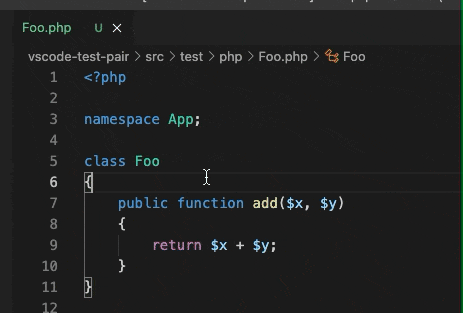

# TestPair


Pair your source/test files from test/source files.



## Features

- Switch to test files from source files.
- Switch to source files from test files.
- Default supported file extensions:
    - `PHP` Foo.php <=> FooTest.hpp
    - `Python` foo.py <=> test_foo.py
    - `Java` Foo.java <=> FooTest.java
    - `Kotlin` Foo.kt <=> FooTest.kt
    - `Groovy` Foo.groovy <=> FooTest.groovy, FooSpec.groovy
    - `JavaScript` foo.js <=> foo.test.js, foo.spec.js, foo.test.ts, foo.spec.ts
    - `TypeScript` foo.ts <=> foo.test.ts, foo.spec.ts
    - `Vue.js` foo.vue  <=> foo.test.js, foo.spec.js, foo.test.ts, foo.spec.ts
    - `React` foo.jsx  <=> foo.test.js, foo.spec.js, foo.test.ts, foo.spec.ts
    - `Ruby` foo.rb  <=> foo_test.rb, foo_spec.rb
    - `Go` foo.go  <=> foo_test.go
    - `Swift` Foo.swift  <=> FooTests.swift
    - `Matlab` Foo.m  <=> FooTest.m
    - `R` foo.r  <=> test_foo.r


## Usage

- `View` > `Command Palette`, Choose `TestPair: Pair the Source/Test file`.
- Or `Ctrl` + `Shift` + `P`


## Define your pair

```js
{
  "testPair.testFileExtensions": [
    {
      // the file extension.
      "extension": "js",

      // the glob pattern for test filenames, @@ as source filename.
      // it will match filenames end with @@.spec.js or @@.test.js.
      "testGlob": "@@{.spec,.test}.js",

      // the glob pattern for source filenames, @@ as source filename.
      // it will remove the test filename parts end with .spec.js or .test.js.
      "sourceGlob": "@@{.spec,.test}",

      // the glob pattern for source file extensions.
      // if ignore it, the default is current file extension.
      // it will match filename with the extension @@.js, @@.vue, @@.jsx
      "sourceExt": "{js,vue,jsx}"
    }
  ]
}

```
